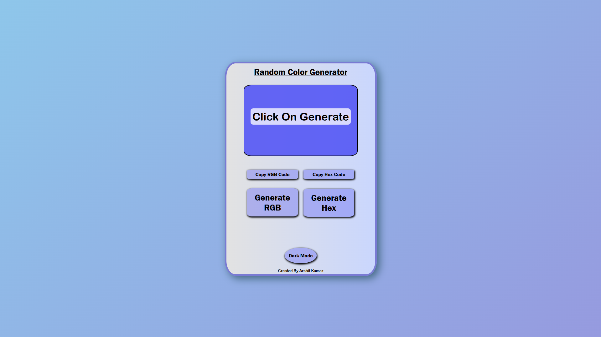
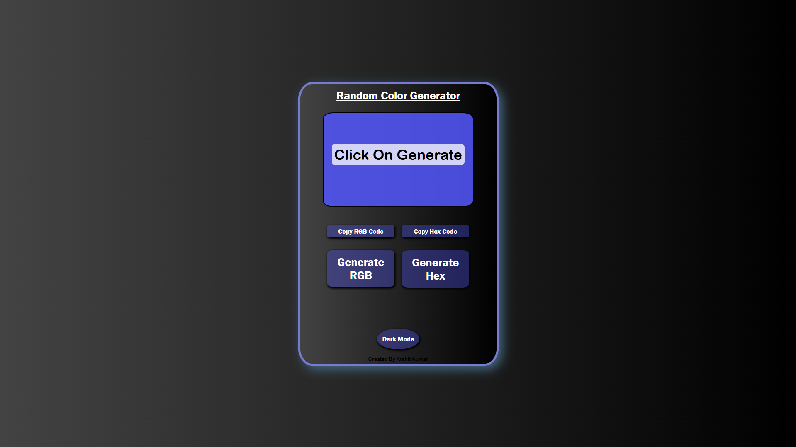

# Random Color Generator with Dark Mode

This project allows users to generate random RGB and Hex colors, display them on the screen, and copy the color codes to the clipboard. It also includes a dark mode toggle for a personalized experience.

---

## **Features**

- **Generate Random RGB Color:** Generates and displays a random RGB color.
- **Generate Random Hex Color:** Generates and displays a random Hex color.
- **Copy Color to Clipboard:** Allows users to copy the generated color to their clipboard.
- **Dark Mode:** Switch between Light and Dark mode for the interface.

---

## **How to Use**

1. **Generate Random Colors:**
   - Click the **"Generate RGB"** button to get a random RGB color.
   - Click the **"Generate Hex"** button to get a random Hex color.
   - The generated color will be displayed in the `screenText` and the background will change accordingly.

2. **Copy the Color Code:**
   - Click the **"Copy RGB"** button to copy the RGB color code.
   - Click the **"Copy Hex"** button to copy the Hex color code.
   - If no color is generated, an alert will prompt you to generate a color first.

3. **Switch Between Light and Dark Mode:**
   - Click the **"Dark Mode"** button to toggle between light and dark modes.

---

## **Technologies Used**
- **HTML**
- **CSS**
- **JavaScript**

---

## **Preview**

### **Light Mode**

### **Dark Mode**

